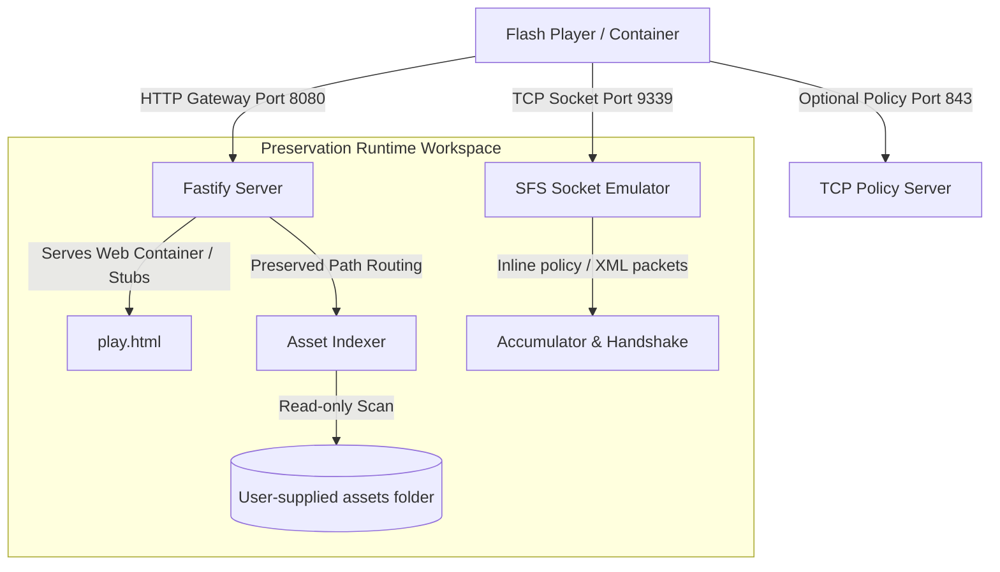

# Project Preservation Architecture

A comprehensive description of the clean-room server and container runtime.

---

## Architecture Overview

The preservation architecture isolates the server into highly decoupled workspaces:

1. **HTTP Gateway (`packages/http-gateway`)**:
   - Manages and routes all HTTP traffic.
   - Decodes complex URL variations such as `/lang.aspx%3flang%3d1`.
   - Uses strict headers (`Cache-Control: no-store`) to bypass caching issues in old Flash players.
   - Logs missing client assets dynamically so developers can identify missing files during game play.

2. **Web Container (`play.html`)**:
   - Embeds the clean SWF client using standard HTML5 `<object>` and `<embed>` fallback elements.
   - Declares safe JavaScript functions (`clientTrace`, `trace`, `sendLog`, `setTitle`, etc.) representing `ExternalInterface` bindings expected by the player.

3. **SmartFox TCP Emulator (`packages/sfs-emulator`)**:
   - Manages standard socket connection lifecycles.
   - Accumulates incoming binary data into null-terminated UTF-8 strings.
   - Detects `<policy-file-request/>` requests inline on port `9339` and answers with a port-restricted policy.
   - Responds to minimal SFS version check queries (`verChk`) with the required `apiOK` handshake.

4. **Optional Policy Server (`packages/flash-policy`)**:
   - Listens optionally on port `843` to resolve permission questions from the player.
   - Gracefully handles administrative port block warnings (`EACCES`), ensuring developers can work on local environments without root privileges.

5. **Path Resolution Safety (`packages/core`)**:
   - Uses absolute resolution boundaries (`resolveSafePath`) to prevent directory traversal attempts, keeping the host system completely secure.
