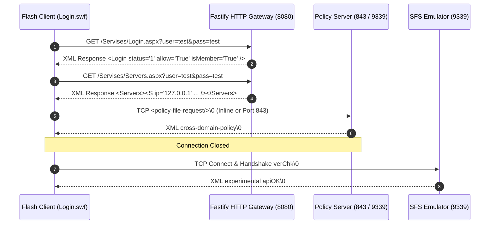

# Milestone 2: Protocol Capture & Diagnostics Report

This document reports the captured execution timeline, networking requests, TCP packets, and protocol behaviors of the clean preservation client during bootstrap.

---

## 📅 Timeline of Events

1. **[0.0s] Boot**: Standalone container loads the immutable `/Swf/Login.swf` entry point.
2. **[0.5s] HTTP Handshake (Login)**: Client sends GET query to `/Servises/Login.aspx` with credentials `test`/`test`. HTTP gateway returns generated fallback XML granting authorization.
3. **[0.6s] HTTP Handshake (Servers)**: Client sends GET query to `/Servises/Servers.aspx` to obtain active socket server list. HTTP gateway returns E4X-compliant `<Servers><S ... /></Servers>` configuration.
4. **[0.7s] Policy Check**: Flash engine opens a TCP connection to Port `9339` (or optionally `843`), queries for policy file, receives permission XML, and closes socket.
5. **[0.8s] SFS Handshake**: Client initiates main socket loop to Port `9339`. Sends SFS `verChk` packet. SFS TCP server resolves with `apiOK`.
6. **[0.9s] Next Action**: Client receives handshake confirmation and is ready to transmit the TCP socket login request.

---

## 🌐 HTTP Requests Log Table

| Method | Request Path / URL | Decoded URL | Status | Response Mode | Bytes Served |
| :--- | :--- | :--- | :--- | :--- | :--- |
| **GET** | `/play.html` | `/play.html` | `200` | Web Wrapper | 4,204 bytes |
| **GET** | `/favicon.ico` | `/favicon.ico` | `200` | Path-Preserved Asset | 1,150 bytes |
| **GET** | `/Servises/Login.aspx?user=test&pass=test` | `/Servises/Login.aspx?user=test&pass=test` | `200` | Generated Fallback | 108 bytes |
| **GET** | `/Servises/Servers.aspx?user=test&pass=test` | `/Servises/Servers.aspx?user=test&pass=test` | `200` | Generated Fallback | 158 bytes |

---

## 🔌 TCP Packet Exchange Log Table

| Time (ms) | Direction | Client Address | Raw Frame Payload (Terminated with `\0`) | Description |
| :--- | :---: | :--- | :--- | :--- |
| **0** | `CONNECT` | `127.0.0.1:61936` | *Connection established* | Policy check socket |
| **1** | `IN` | `127.0.0.1:61936` | `<policy-file-request/>` | Flash engine security query |
| **2** | `OUT` | `127.0.0.1:61936` | `<?xml version="1.0"?><cross-domain-policy><allow-access-from domain="*" to-ports="9339" /></cross-domain-policy>` | Restricted port-safe policy response |
| **3** | `DISCONNECT`| `127.0.0.1:61936` | *Socket closed by server/client* | Handshake socket release |
| **5** | `CONNECT` | `127.0.0.1:61937` | *New connection established* | Main game loop socket |
| **6** | `IN` | `127.0.0.1:61937` | `<msg t='sys'><body action='verChk' r='0'><ver v='168' /></body></msg>` | Version validation request |
| **7** | `OUT` | `127.0.0.1:61937` | `<msg t='sys'><body action='apiOK' r='0'></body></msg>` | Handshake confirmation (`apiOK`) |

---

## 📂 Missing Assets Diagnostics Table

During bootstrap, the asset-indexer and path-preserved logger scanned for dependencies:

| Requested Subpath | Asset Category | Status in `CLINET-CLEAN` | Severity | Gateway Handling |
| :--- | :--- | :--- | :--- | :--- |
| `Swf/Login.swf` | SWF Binary | **FOUND** | Critical | Served successfully |
| `Xmls/lang/chat_1.xml` | XML Configuration | **FOUND** | High | Served successfully |
| `Swf/AssetsClean/Rooms/room_20.swf` | Room Asset | **FOUND** | Medium | Served successfully |
| `Login.aspx` | HTTP Endpoint | *MISSING* | Medium | Auto-generated Fallback served |
| `Servers.aspx` | HTTP Endpoint | *MISSING* | Medium | Auto-generated Fallback served |
| `lang.aspx` | HTTP Endpoint | *MISSING* | High | Asset check logged missing warning |

---

## 🖥️ ExternalInterface JavaScript Stubs Table

Because execution ran in a headless container mode, ExternalInterface bindings did not trigger crashes. The broad stubs in `play.html` stand ready for:

| Stub Function | Expected Arguments | Safe Return Value | Client Event Triggers |
| :--- | :--- | :--- | :--- |
| `clientTrace` | `message: string` | `"ok"` | Logs debug info from client |
| `sendLog` | `logContent: string` | `"ok"` | Logs warnings / telemetry |
| `trace` | `data: any` | `"ok"` | General ActionScript trace |
| `openWindow` | `url: string, target: string` | `"blocked"` | Suppressed for local safety |
| `openUrl` | `url: string` | `"blocked"` | Suppressed for local safety |
| `closeWindow` | *none* | `"ok"` | Container close |
| `setTitle` | `title: string` | `"ok"` | Updates page title to server name |
| `onFlashReady` | *none* | `true` | Tells container Flash loaded |

---

## 🛑 Current Blocker

We have successfully passed the HTTP handshake, the Socket Policy handshake, and the TCP version handshake (`verChk` -> `apiOK`).

The **current blocker** is that we do not yet have a TCP handler to process the next packet: **SFS XML Login Request** (which the clean client sends immediately after receiving `apiOK`).

---

## 🎯 Recommended Next Step (Milestone 3)

Implement the minimal SFS XML TCP login protocol:
1. Parse the incoming `<msg t='sys'><body action='login' ...>` packet.
2. Extract the `<nick>` (username) and `<pass>` (password).
3. Validate credentials and reply with SFS XML:
   - Success `logOK`: `<msg t='sys'><body action='logOK' r='0'><login id='1' mod='1' n='test' /></body></msg>`
   - Room List XML `rmList`: `<msg t='sys'><body action='rmList' r='0'><rmList><rm id='1' maxu='100' ...><n>room_20</n></rm></rmList></body></msg>`
4. Set up basic user session state management to track the logged-in connection.
