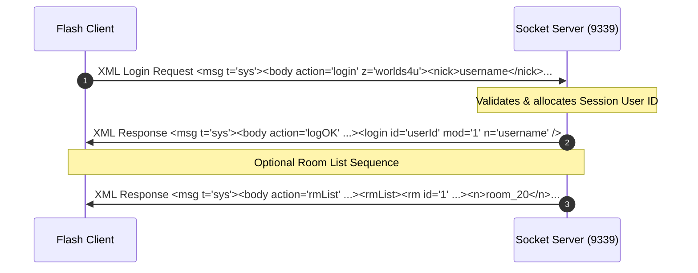

# Milestone 3: SmartFox XML TCP Login Flow

This document details the minimal SmartFoxServer XML login specifications implemented for compliance with the clean client player, verified logs, and configuration matrices.

---

## 🔄 Login Packet Architecture

Once the client resolves the handshake version check (`verChk` -> `apiOK`), it initiates the authentication request.



---

## 1. Incoming XML Login Request

The client sends a standard SFS XML system packet structure:

```xml
<msg t='sys'>
  <body action='login' r='0'>
    <login z='worlds4u'>
      <nick><![CDATA[username]]></nick>
      <pass><![CDATA[password]]></pass>
    </login>
  </body>
</msg>
```

- **z**: Requested SFS Zone (value: `"worlds4u"`).
- **nick**: Extracted player username inside a `CDATA` block.
- **pass**: Extracted player password inside a `CDATA` block.

---

## 2. In-Memory Session Management

Upon receiving the login request, the server allocates:
- **User ID**: An auto-incrementing integer starting at `1`.
- **Username**: The extracted nickname.
- **Moderator Permissions**: Defaults to `true` or is set via configuration.

---

## 3. Server XML Responses

### A. Authentication Success (`logOK`)
```xml
<msg t='sys'>
  <body action='logOK' r='0'>
    <login id='${userId}' mod='1' n='${username}' />
  </body>
</msg>
```

### B. Room List Sequence (`rmList`)
If the client requires the list of active rooms to progress, the server sends a minimal `<rmList>` payload containing the default entrance room details:
```xml
<msg t='sys'>
  <body action='rmList' r='0'>
    <rmList>
      <rm id='1' maxu='100' maxs='0' temp='0' game='0' priv='0' lmb='0' ucnt='1' scnt='0'>
        <n>room_20</n>
      </rm>
    </rmList>
  </body>
</msg>
```
Both packets are null-terminated (`\0`) and transmitted over the TCP connection.

---

## 4. Configuration Properties

The following properties have been introduced in `packages/core/src/config.ts` for customizing authentication and initial room listing behavior:

| Config Property | Type | Default | Description |
| :--- | :---: | :---: | :--- |
| `acceptAnyLogin` | `boolean` | `true` | When true, accepts any username/password combination |
| `defaultUserModerator` | `boolean` | `true` | When true, assigns moderator permissions (`mod='1'`) to all logged-in sessions |
| `sendRoomListAfterLogin` | `boolean` | `false` | When true, appends the room list packet (`rmList`) immediately after `logOK` |
| `defaultRoomName` | `string` | `"room_20"` | The room name included in the `<rmList>` payload |
| `defaultRoomId` | `number` | `1` | The room ID included in the `<rmList>` payload |

---

## 5. Verified Client Packet Trace

Below is the verified trace captured by our server’s detailed packet logging showing the client's socket transmission and the server's processed output:

```
[TCP-DEBUG] === DETAILED PACKET LOG #1 (Client: 127.0.0.1:55609) ===
[TCP-DEBUG] Raw Packet: <msg t='sys'><body action='login' r='0'><login z='worlds4u'><nick><![CDATA[myUser]]></nick><pass><![CDATA[myPass]]></pass></login></body></msg>
[TCP-DEBUG] Decoded XML Action: "login"
[TCP-DEBUG] Body Attributes: {"action":"login","r":"0"}
[TCP-DEBUG] Child Node Names: ["login","nick","pass"]
[TCP-DEBUG] Extracted Fields - Zone: "worlds4u", Username: "myUser", Password Length: 6
[TCP-DEBUG] ==========================================================
[SFS] Processing incoming TCP Login packet...
[SFS] Extracted SFS Login properties - Zone: "worlds4u", Nick: "myUser", Pass Length: 6
[SFS] [SUCCESS] Created active TCP session - User ID: 2, Name: "myUser", Moderator: true
```

