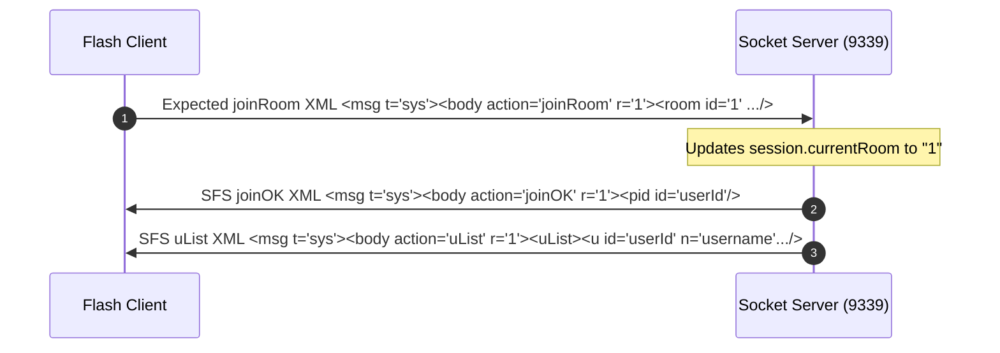

# Milestone 4: Minimal Room Join Capture + Response (Provisional)

This document specifies the provisional room join protocol mapping, packet structures, and user listing sequences implemented for compliance with the clean Flash player. 

> [!IMPORTANT]
> **Live GUI Validation Status**: Pending live clean SWF validation. 
> The current socket handling logic is **implemented and unit-tested**, and has been verified to be **protocol-compatible according to simulated SFS exchange**, but has not yet been fully validated against a live clean GUI player connection.

---

## 🔄 Room Join Sequence (Expected)

Once the client completes login validation, it is expected to parse the room list (`rmList`) and initiate a room join request to enter `room_20` (ID: `1`).



---

## 1. Expected/Provisional XML joinRoom Request

The clean Flash client is expected to transmit the standard SFS XML join room structure:

```xml
<msg t='sys'>
  <body action='joinRoom' r='1'>
    <room id='1' o='-1' spec='0' p='' />
  </body>
</msg>
```

- **r / id**: The target room ID requested by the client (maps to default ID `1`).
- **o**: Old room ID (`-1` represents joining from no room).
- **spec**: Spectator flag (`0` for player, `1` for spectator).
- **p**: Password string (empty if public).

---

## 2. Server XML Responses (Provisional)

To successfully transition past room initialization, the client library is expected to require the SFS room entrance packet chain. Both responses are null-terminated (`\0`) and sent consecutively:

### A. Join Confirmation (`joinOK`)
```xml
<msg t='sys'>
  <body action='joinOK' r='${roomId}'>
    <pid id='${userId}' />
  </body>
</msg>
```
- **r**: Joined room ID.
- **pid**: Player ID allocated within this room (corresponds to the connection’s User ID).

### B. Room User Registry (`uList`)
```xml
<msg t='sys'>
  <body action='uList' r='${roomId}'>
    <uList>
      <u id='${userId}' name='${username}' mod='1' spec='0'>
        <vars />
      </u>
    </uList>
  </body>
</msg>
```
- **uList**: List of players currently registered in the room.
- **vars**: Room user variable bindings (initially empty).

---

## 3. Session State Changes

The SFS emulator updates the session user data in memory:
* **Session `currentRoom`**: Updated to the requested room ID (`"1"`).
* **Room Registry**: Tracks active socket user association.

---

## 4. Runtime Logging Markers

To separate test/simulated interactions from real TCP client packets, the server logs specific markers during `joinRoom` processing depending on the context of the connection:

* **Simulated test packets** (connections established inside automated unit/integration tests):
  `[ROOM] Simulated test joinRoom received - User: "<name>"`
* **Runtime client packets** (connections established in the live running server environment):
  `[ROOM] Runtime client joinRoom received - User: "<name>"`

---

## 5. Manual Validation Checklist

To complete live verification of Milestone 4, execute the following validation steps:

- [ ] **Start Emulator Server**: Run with `sendRoomListAfterLogin: true` enabled via config (`server.yml`).
- [ ] **Open Client Container**: Open a Flash-capable browser or container manually.
- [ ] **Load Web Gateway**: Navigate to `http://localhost:8080/play.html`.
- [ ] **Attempt Login**: Enter test credentials and click log in.
- [ ] **Confirm SFS joinRoom XML**: Verify the console outputs the incoming socket packet:
  ```text
  [ROOM] Runtime client joinRoom received - User: "<username>"
  ```
- [ ] **Confirm Asset Request**: Verify in the gateway console that `room_20.swf` is requested from `/Swf/AssetsClean/Rooms/room_20.swf` after `joinOK + uList` is transmitted.
- [ ] **Identify Next Action**: Capture and document the next incoming socket packet (e.g. `setUserVars` or extension request) to determine Milestone 5 specifications.
